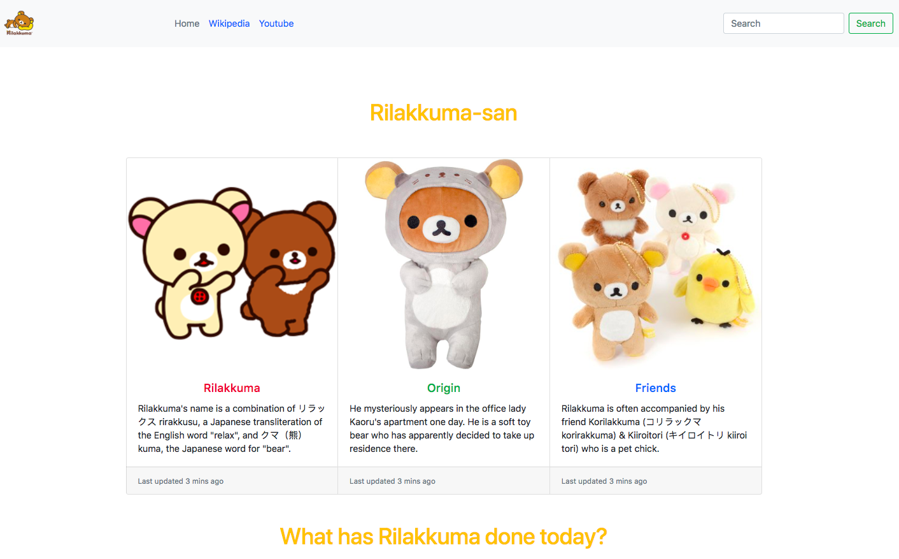
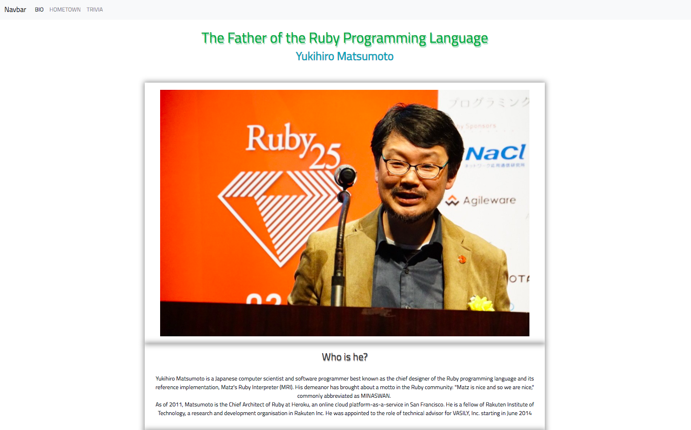

# Practicing Bootstrap
I am building 2 tribute pages. The first one is for my all-time favourite San-X character, Rilakkuma. He is a cultural icon and a very "Relaxed Bear" :)

The second one is for my favourite computer scientist. He's the father of the programming langue, Ruby, Yukihiro Matsumoto.  

